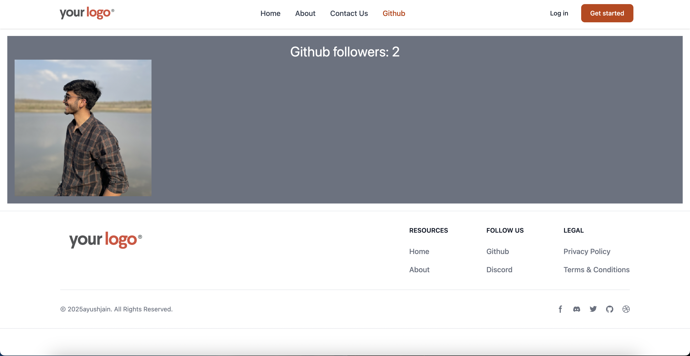

```markdown
# Project Title



## Overview

This project is a React application that serves as a multi-page website with various components and routes. It includes a layout with a header and footer, and pages for Home, About, Contact, User, and Github information.

## Installation

To get started with this project, clone the repository and install the dependencies:

```bash
git clone <repository-url>
cd <project-directory>
npm install
```

## Usage

To run the application locally, use the following command:

```bash
npm start
```

This will start the development server and open the application in your default web browser.

## Components

- **Layout**: The main layout component that includes the header, footer, and an outlet for nested routes.
- **Home**: The homepage with a call-to-action and images.
- **About**: A page providing information about the project or organization.
- **Contact**: A contact form for users to get in touch.
- **User**: Displays user information based on the URL parameter.
- **Github**: Fetches and displays data from a GitHub user profile.

## Routes

- `/`: Home page
- `/about`: About page
- `/contact-us`: Contact page
- `/users/:id`: User page with dynamic user ID
- `/github`: Github information page

## Contributing

Contributions are welcome! Please fork the repository and submit a pull request for any improvements or bug fixes.

## License

This project is licensed under the MIT License.
```